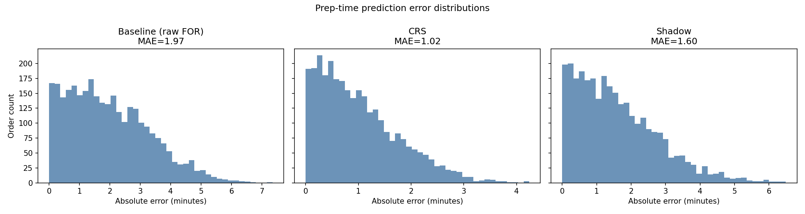
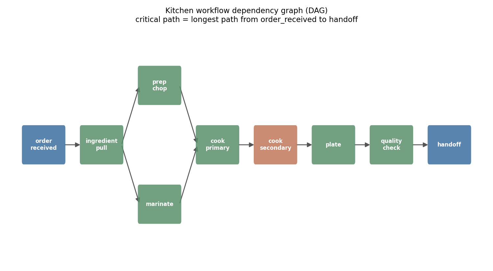

<div align="center">

# 🍳 KPT2 — Multi-Signal Kitchen Prep Time Intelligence

**A causally-simulated prediction system that corrects noisy, merchant-reported kitchen timestamps by fusing bias correction, graph-based workflow resolution, real-time congestion scoring, and an independently-fitted composite model.**

[](https://www.python.org/)
[](https://github.com/Satyam5367/kpt2-multisignal-intelligence/actions/workflows/tests.yml)
[](kpt2/LICENSE)
[](https://github.com/psf/black)

**[📖 Full documentation →](kpt2/README.md)** &nbsp;·&nbsp; **[⚡ Quick start](#-quick-start)** &nbsp;·&nbsp; **[📊 Results](#-results)** &nbsp;·&nbsp; **[🧠 How it works](#-how-it-works)**

</div>

<br>

## The problem

In a food-delivery pipeline, a merchant marking "order ready" is the
only signal a platform has for when a rider should be dispatched. That
signal is unreliable: merchants habitually mark early or late, and
during rush hour they mark *even earlier* to keep their queue moving —
a distortion that's invisible to a simple per-merchant average
correction. **KPT2 fuses four independent signals to recover a
materially more accurate readiness estimate than the raw signal alone.**

## 📊 Results

Measured out-of-sample, on a held-out time-ordered test split:

<div align="center">

| Model | MAE (min) | P50 error | P90 error |
|:--|:-:|:-:|:-:|
| Baseline — raw merchant signal | 1.97 | 1.82 | 3.83 |
| **Composite Readiness Score (CRS)** | **0.97** ⬇ 51% | **0.84** | **1.96** |
| Shadow Model — *zero* merchant input | 1.60 ⬇ 19% | 1.38 | 3.14 |

</div>

<div align="center">

</div>

> The Shadow Model is given **no access to the merchant's timestamp at
> all**, and still beats the naive baseline — proving the fused signals
> carry real information on their own, not just a repackaging of what
> the merchant already reported.

## 🧠 How it works

<div align="center">

</div>

A kitchen order isn't one number — it's a small dependency graph of
prep steps, some parallel, some sequential. The true minimum prep time
is the **critical path** through that graph, computed with a
hand-rolled topological sort (Kahn's algorithm) + dynamic-programming
longest-path pass — no graph library, just the algorithm.

| Signal | Technique | Module |
|:--|:--|:--|
| Merchant Bias Index | per-merchant mean-offset correction | `merchant_bias.py` |
| Kitchen Load Score | min-heap interval-overlap sweep + sliding-window rider clustering | `simulation.py` |
| Workflow duration estimate | DAG + topological sort + critical-path DP | `workflow_graph.py` |
| Historical pattern | bounded deque, O(1)-amortized rolling average | `historical_tracker.py` |
| **Composite Readiness Score** | fitted regression with a congestion-interaction term | `composite_scoring.py` |
| Shadow Model | same features, FOR excluded entirely | `shadow_model.py` |

<details>
<summary><b>Why I rebuilt this from an earlier prototype (click to expand)</b></summary>
<br>

An earlier version generated most "signals" as independent random
noise with no causal link to ground truth, blended with fixed,
hand-picked weights — and its own evaluation showed the result
performing *worse* than the naive baseline, plus a crash that meant it
never printed final numbers. This version fixes both at the root:
every signal is now causally simulated or estimated, and CRS is a
**fitted** model evaluated on a held-out split, so the reported
improvement is honest rather than assumed. Full writeup in
[`kpt2/README.md`](kpt2/README.md#design-notes--what-i-fixed-from-v1).

</details>

## ⚡ Quick start

```bash
git clone https://github.com/Satyam5367/kpt2-multisignal-intelligence.git
cd kpt2-multisignal-intelligence/kpt2
pip install -r requirements.txt
python main.py
```

```bash
# run the test suite (17 tests, incl. a regression test that guards
# against CRS ever performing worse than the raw baseline again)
pytest -v
```

## 🗂 Repository structure

```
.
├── .github/workflows/tests.yml   ← CI: runs the test suite on every push
└── kpt2/                         ← the project (see kpt2/README.md)
    ├── main.py                     CLI entry point
    ├── src/kpt2/                   source modules
    │   └── db/                     MySQL schema + SQLAlchemy data layer
    ├── tests/                      pytest suite (17 tests)
    └── assets/                     sample output plots
```

## 🛠 Tech stack

Python · NumPy · pandas · scikit-learn · SQLAlchemy · MySQL · pytest · matplotlib · GitHub Actions

## 📜 License

MIT — see [`kpt2/LICENSE`](kpt2/LICENSE)
